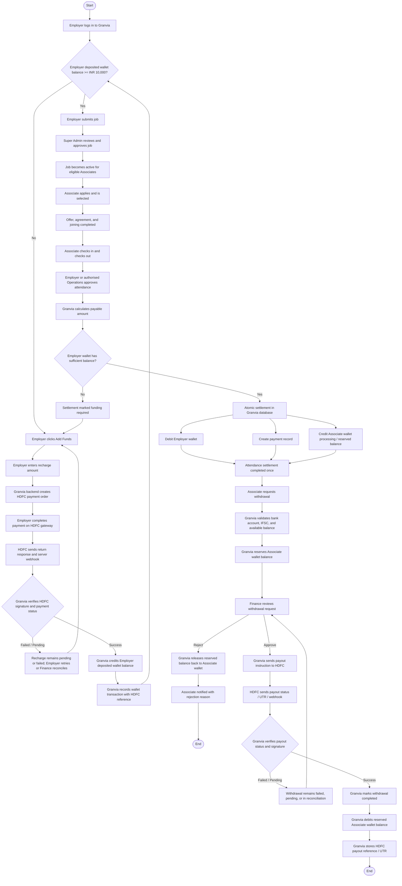

# Granvia HDFC Payment Gateway Flow Chart



## Short Flow

```text
Employer Add Funds
-> HDFC collects payment
-> Granvia verifies webhook/status
-> Employer deposited wallet is credited
-> Employer posts job
-> Associate works and attendance is approved
-> Granvia debits Employer wallet and credits Associate wallet
-> Associate requests withdrawal
-> Finance approves
-> HDFC processes payout
-> Granvia records payout reference and completes withdrawal
```

