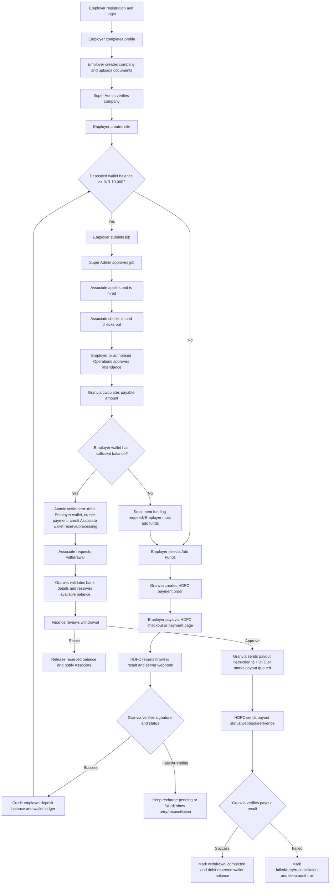

# Granvia Payment Gateway Process Flow for HDFC Bank

Prepared for: HDFC Bank payment gateway onboarding enquiry  
Project: Granvia employer and associate workforce platform  
Date: 2026-09-17  
Currency: INR

## 1. Purpose

This document explains the proposed payment process for Granvia using the current project flow and latest business-process markdown files.

Granvia has two financial rails:

1. Employer wallet recharge: Employer adds money to Granvia through the payment gateway. This deposited balance is used to post jobs and settle approved attendance.
2. Associate payout: Associate requests withdrawal from wallet earnings. Finance approves the request and the payment gateway/bank payout rail transfers funds to the Associate's verified bank account.

The current code contains wallet, ledger, withdrawal, Finance approval, and manual completion flows. The live bank gateway integration should replace the temporary mock recharge and manual payout completion with HDFC order/payment/webhook and payout confirmation flows.

## 2. Actors

| Actor | Responsibility |
| --- | --- |
| Employer | Recharges wallet, posts jobs, approves attendance, views wallet statement. |
| Associate | Completes work, receives wallet credit after approved attendance, requests withdrawal. |
| Finance | Reviews Associate withdrawal requests and approves/rejects bank payout. |
| Super Admin | Monitors wallet, credits, payments, reports, exceptions, and audit history. |
| Granvia Backend | Validates all business rules, creates gateway requests, verifies callbacks, and writes ledgers. |
| HDFC Gateway | Collects Employer payment, returns transaction result, sends webhook/status updates, and processes payouts where enabled. |

## 3. Key Business Rules

1. Employer deposited balance and Super Admin credit are separate.
2. Employer must maintain at least INR 10,000 deposited balance before submitting a new job. Super Admin credit does not count for this minimum.
3. Approved attendance can be settled only once.
4. Employer wallet debit and Associate wallet credit must happen in one database transaction.
5. Associate withdrawal must reserve wallet balance before Finance approval so the same amount cannot be withdrawn twice.
6. Finance approval is required before normal bank payout.
7. Gateway callbacks must be signature-verified and idempotent.
8. Completed ledger entries must never be deleted or silently edited; reversals/refunds need separate audited entries.

## 4. Main End-to-End Flow



## 5. Employer Wallet Recharge Flow

### 5.1 Current Granvia behavior

Current route and code path:

| Layer | Path |
| --- | --- |
| Frontend service | `frontend/src/services/walletService.ts` |
| API route | `POST /employer/wallet/recharge` |
| Controller | `nodebackend/src/controllers/walletController.ts` |
| Tables | `employer_wallets`, `wallet_transactions` |

At present, recharge immediately credits the Employer wallet with source `mock_gateway_recharge`. For HDFC production, this must become a two-step gateway flow.

### 5.2 Required HDFC production flow

1. Employer opens Wallet > Add Funds.
2. Employer enters recharge amount.
3. Backend validates:
   - Employer is authenticated and active.
   - Amount is positive and within configured limits.
   - Currency is INR.
4. Backend creates an internal recharge request with status `pending`.
5. Backend calls HDFC create-order/payment API with:
   - Merchant ID.
   - Unique Granvia order/recharge ID.
   - Amount and INR currency.
   - Employer ID/reference.
   - Return URL.
   - Webhook/callback URL.
6. Employer completes payment on HDFC hosted/SDK flow.
7. HDFC sends browser return and server webhook.
8. Backend verifies HDFC signature/checksum and fetches status if needed.
9. On confirmed success only:
   - Credit `employer_wallets.balance`.
   - Credit `employer_wallets.deposit_balance`.
   - Increment `employer_wallets.total_recharged`.
   - Create `wallet_transactions` row with `transaction_type=credit`, `source=hdfc_gateway_recharge`, gateway order/payment reference, status `completed`.
10. On failure:
   - Keep wallet unchanged.
   - Mark recharge/payment attempt failed.
   - Show retry option.
11. On pending/timeout:
   - Keep wallet unchanged until webhook/status enquiry confirms success.
   - Finance/Super Admin can reconcile using gateway reference.

## 6. Job Posting Funding Control

Before an Employer can submit a job, the backend checks deposited wallet balance.

Current route and code path:

| Layer | Path |
| --- | --- |
| API route | `POST /employer/jobs` |
| Controller | `nodebackend/src/controllers/jobController.ts` |
| Rule | `MIN_EMPLOYER_DEPOSIT_BALANCE = 10000` |

Required rule for bank-facing process:

```text
Employer deposited balance >= INR 10,000
```

Important: Super Admin credit is separate and must not satisfy this minimum deposit requirement.

## 7. Attendance Settlement Flow

### 7.1 Trigger

Settlement starts only when completed attendance is approved by Employer, Super Admin, or authorised Operations flow.

Current route and code path:

| Layer | Path |
| --- | --- |
| Employer approval route | `PATCH /employer/attendance/:record/status` |
| Admin approval route | `PATCH /admin/attendance/:record/status` |
| Controller | `nodebackend/src/controllers/attendanceController.ts` |
| Wallet debit helper | `debitEmployerWalletForPayment()` in `walletController.ts` |
| Tables | `attendance_records`, `payments`, `employer_wallets`, `wallet_transactions`, `associate_wallets`, `associate_wallet_transactions` |

### 7.2 Settlement steps

1. Employer opens attendance and approves a completed check-in/check-out record.
2. Backend validates:
   - Attendance exists.
   - Attendance belongs to the Employer if Employer is approving.
   - Check-in and check-out exist.
   - Total hours are positive.
   - Attendance is not already approved/rejected.
   - No existing pending/processing/completed payment exists for the attendance.
3. Backend calculates payable amount:
   - Hourly jobs: hourly rate multiplied by approved hours.
   - Daily jobs: daily rate or job salary amount.
4. Backend creates `payments` row with method `wallet_attendance` and status `processing`.
5. Backend debits Employer wallet.
6. Backend creates Employer wallet debit ledger row.
7. Backend credits Associate wallet reserved/processing balance.
8. Backend creates Associate wallet transaction linked to payment.
9. Backend marks attendance approved.
10. Notifications are sent to Employer, Associate, and Super Admin/Finance as required.

This settlement is internal wallet accounting. It should not call HDFC again because the Employer money was already collected during wallet recharge.

## 8. Associate Withdrawal and Bank Payout Flow

### 8.1 Current Granvia behavior

Current route and code path:

| Layer | Path |
| --- | --- |
| Associate request | `POST /guard/withdrawals` |
| Finance list | `GET /finance/withdrawals` |
| Finance decision | `PATCH /finance/withdrawals/:withdrawal/decision` |
| Manual completion | `POST /finance/withdrawals/:withdrawal/complete` |
| Controller | `nodebackend/src/controllers/withdrawalController.ts` |
| Tables | `associate_wallets`, `associate_wallet_transactions`, `withdrawal_requests` |

Current completion accepts a manually entered `gateway_reference`. For HDFC production, this should become gateway payout initiation plus webhook/status confirmation.

### 8.2 Required HDFC payout flow

1. Associate opens Wallet > Withdraw.
2. Backend validates:
   - Associate is authenticated and active.
   - Bank account number and IFSC exist in profile.
   - Requested amount is positive.
   - Available wallet balance is sufficient.
3. Backend creates `withdrawal_requests` row with status `requested`.
4. Backend moves amount from Associate available balance to reserved balance.
5. Finance receives notification.
6. Finance reviews Associate, bank account, amount, source ledger entries, and risk flags.
7. If Finance rejects:
   - Withdrawal becomes `rejected`.
   - Reserved balance is released back to available balance.
   - Associate is notified with reason.
8. If Finance approves:
   - Withdrawal becomes `approved`.
   - Backend creates or sends payout instruction to HDFC using the withdrawal idempotency key.
   - Withdrawal becomes `processing` or gateway status `queued`.
9. HDFC sends payout response/webhook/status.
10. Backend verifies signature and reference.
11. On confirmed success:
   - Withdrawal becomes `completed`.
   - Reserved balance is consumed/debited.
   - Associate wallet transaction is recorded as `withdrawal_paid`.
   - Gateway provider, reference, status, and response are stored.
12. On failure:
   - Withdrawal becomes `failed` or remains in reconciliation queue according to final HDFC status.
   - Reserved funds are either retained for retry or released by an audited Finance action, depending on failure type.

## 9. Recommended API Touchpoints for HDFC Integration

The exact HDFC API names depend on the product issued by the bank. Granvia should support these logical operations:

| Direction | Granvia operation | HDFC operation expected |
| --- | --- | --- |
| Collect | Create recharge order | Create payment/order/session |
| Collect | Verify payment | Webhook verification and/or transaction status enquiry |
| Collect | Refund/reversal if enabled | Refund API with audited reversal ledger |
| Payout | Initiate approved withdrawal | Fund transfer/payout API |
| Payout | Confirm payout | Webhook/status enquiry |
| Reconciliation | Daily gateway matching | Settlement report/transaction enquiry |

## 10. Data Fields to Exchange

### 10.1 Employer recharge

| Field | Description |
| --- | --- |
| `granvia_recharge_id` | Internal unique recharge/order id. |
| `employer_user_id` | Employer reference. |
| `amount` | Recharge amount in INR. |
| `currency` | INR. |
| `return_url` | Browser redirect URL after payment. |
| `webhook_url` | Server-to-server callback endpoint. |
| `hdfc_order_id` | HDFC order/session reference. |
| `hdfc_payment_id` | HDFC transaction/payment reference. |
| `status` | pending, completed, failed, cancelled, refunded. |

### 10.2 Associate payout

| Field | Description |
| --- | --- |
| `withdrawal_request_id` | Internal unique withdrawal id. |
| `idempotency_key` | Stable key to prevent duplicate payout. |
| `associate_user_id` | Associate reference. |
| `beneficiary_name` | Name from verified profile/bank proof. |
| `bank_account_number` | Associate account number. |
| `ifsc` | Associate bank IFSC. |
| `amount` | Net payout amount in INR. |
| `hdfc_reference` | HDFC payout/UTR/reference. |
| `status` | requested, approved, processing, completed, failed, rejected. |

## 11. Webhook and Security Controls

1. All HDFC webhooks must be received on HTTPS only.
2. Verify HDFC signature/checksum before updating any payment or payout status.
3. Store raw webhook payload safely for audit/reconciliation.
4. Use idempotency keys for recharge and withdrawal/payout processing.
5. Reject duplicate successful callback processing.
6. Never trust browser return alone for wallet credit or payout completion.
7. Use server-to-server status enquiry when webhook and browser return disagree.
8. Keep payment credentials in environment variables, not source code.
9. Restrict Finance and Admin routes by authenticated role.
10. Maintain immutable ledger rows for every credit, debit, reserve, release, refund, or reversal.

## 12. Reconciliation and Reports

Granvia should reconcile daily:

1. HDFC successful collections vs `wallet_transactions` recharge credits.
2. HDFC failed/pending collections vs pending internal recharge attempts.
3. HDFC payout references vs `withdrawal_requests`.
4. Employer wallet balance:
   - Opening balance.
   - HDFC recharge credits.
   - Super Admin credits.
   - Job/attendance settlement debits.
   - Closing balance.
5. Associate wallet balance:
   - Attendance settlement credits.
   - Withdrawal reserves.
   - Withdrawal paid debits.
   - Rejected withdrawal releases.
   - Closing balance.

## 13. Exceptions

| Scenario | Required handling |
| --- | --- |
| Employer payment success at HDFC but webhook delayed | Keep recharge pending until webhook/status enquiry confirms success. |
| Browser says success but HDFC status fails | Do not credit wallet. Show pending/failed and reconcile. |
| Duplicate webhook | Return success acknowledgement but do not post duplicate wallet credit/debit. |
| Employer wallet insufficient for attendance settlement | Mark settlement as funding required and direct Employer to Add Funds. |
| Associate payout failed | Mark failed/retry/reconciliation; do not silently delete request. |
| Refund/reversal | Create separate reversal transaction, never edit the original completed ledger silently. |

## 14. Current Implementation Gaps Before Production HDFC Go-Live

1. Replace `mock_gateway_recharge` in `walletController.ts` with pending recharge order creation, HDFC checkout/order creation, webhook verification, and final wallet credit.
2. Add persistent recharge/order table or extend wallet transaction/payment data enough to track pending HDFC orders before wallet credit.
3. Add HDFC webhook routes for collection and payout status.
4. Replace manual Finance payout completion with HDFC payout initiation/status confirmation.
5. Store HDFC gateway reference/status/response consistently for recharge and withdrawal.
6. Add reconciliation report/export for Finance/Super Admin.
7. Align employer job submission implementation with documented approval flow if bank/demo process requires jobs to be pending until Super Admin approval.

## 15. Short Process Summary for HDFC

```text
Employer adds wallet funds
-> Granvia creates HDFC payment order
-> HDFC collects payment
-> Granvia verifies webhook/status
-> Granvia credits Employer deposited wallet balance
-> Employer posts job after INR 10,000 deposited-balance check
-> Associate completes shift
-> Employer approves attendance
-> Granvia debits Employer wallet and credits Associate wallet internally
-> Associate requests withdrawal
-> Finance approves
-> Granvia sends payout instruction to HDFC
-> HDFC confirms payout
-> Granvia marks withdrawal completed and records gateway reference
```

